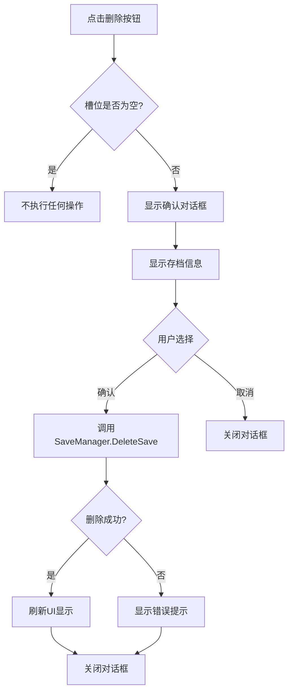

# 删除存档功能设计方案

## 需求分析

在存档/读档面板中添加删除存档功能，允许玩家删除不需要的存档。

## 设计目标

1. **用户友好**: 提供清晰的删除按钮和确认机制
2. **安全性**: 防止误删，需要二次确认
3. **视觉反馈**: 删除后立即更新UI显示
4. **保护自动存档**: 可选择是否允许删除自动存档

## UI设计方案

### 方案一：每个槽位独立删除按钮（推荐）

```
SaveSlot
├── SlotButton (主按钮 - 点击加载)
├── Screenshot
├── SlotIdText
├── ChapterNameText
├── SaveTimeText
├── PlayTimeText
├── DeleteButton (新增 - 删除按钮) ⭐
│   └── Icon/Text ("×" 或 "删除")
└── EmptySlotIndicator
```

**优点**:
- 直观，每个槽位都有自己的删除按钮
- 操作快捷，不需要切换模式
- 符合用户习惯

**缺点**:
- UI空间占用较多
- 需要确认对话框防止误删

### 方案二：全局删除模式切换

```
SaveLoadPanel
├── Title
├── ModeToggleButton (新增 - "删除模式" 切换按钮)
├── SaveSlots (在删除模式下，点击槽位=删除)
└── BackButton
```

**优点**:
- UI简洁，不占用额外空间
- 可以批量删除多个存档

**缺点**:
- 需要额外的模式切换步骤
- 用户可能不容易发现此功能

### 方案三：长按删除

长按存档槽位2秒触发删除确认对话框。

**优点**:
- UI最简洁
- 移动端友好

**缺点**:
- PC端用户可能不习惯
- 缺少视觉提示

## 推荐方案：方案一 + 确认对话框

### UI层级结构

```
SaveLoadPanel
├── SaveSlots
│   ├── AutoSaveSlot
│   │   ├── SlotButton
│   │   ├── DeleteButton (可选：自动存档可以禁用删除)
│   │   └── ... (其他UI元素)
│   ├── ManualSaveSlot_0
│   │   ├── SlotButton
│   │   ├── DeleteButton
│   │   └── ...
│   ├── ManualSaveSlot_1
│   └── ManualSaveSlot_2
└── ConfirmDialog (新增 - 确认对话框，默认隐藏)
    ├── Background (半透明遮罩)
    ├── DialogPanel
    │   ├── TitleText ("确认删除")
    │   ├── MessageText ("确定要删除此存档吗？此操作无法撤销。")
    │   ├── SlotInfoText ("存档1 - 第一章 - 2024-01-01 12:00")
    │   ├── ButtonConfirm ("确认删除")
    │   └── ButtonCancel ("取消")
```

## 功能流程

### 删除流程



### 特殊处理

1. **自动存档保护**（可选）
   - 可以设置自动存档不可删除
   - 或者需要额外的确认步骤

2. **最后一个存档保护**（可选）
   - 如果只剩一个存档，可以提示用户
   - 或者禁止删除最后一个存档

## 代码实现计划

### 1. SaveSlotUI 修改

添加以下内容：
- `deleteButton` 字段
- `onDeleteClicked` 回调
- `Initialize()` 方法增加删除回调参数
- `OnDeleteButtonClicked()` 方法

### 2. MainMenuController 修改

添加以下内容：
- `confirmDialog` 引用
- `currentDeletingSlotId` 字段（记录待删除的槽位）
- `OnDeleteSlotRequested(int slotId)` 方法
- `ShowDeleteConfirmDialog(int slotId)` 方法
- `OnConfirmDelete()` 方法
- `OnCancelDelete()` 方法
- `RefreshSaveSlots()` 在删除后调用

### 3. 新建 ConfirmDialog 组件（可选）

创建一个通用的确认对话框组件：
- `Show(string title, string message, Action onConfirm, Action onCancel)`
- `Hide()`

## 配置选项

在 MainMenuController 中添加配置：

```csharp
[Header("删除存档设置")]
[SerializeField] private bool allowDeleteAutoSave = false; // 是否允许删除自动存档
[SerializeField] private bool protectLastSave = false;     // 是否保护最后一个存档
```

## 用户体验优化

### 视觉设计

1. **删除按钮样式**
   - 使用红色或警告色
   - 图标：垃圾桶或 "×"
   - 位置：槽位右上角或右侧

2. **确认对话框**
   - 半透明背景遮罩
   - 居中显示
   - 清晰显示要删除的存档信息
   - 确认按钮使用警告色

3. **动画效果**（可选）
   - 删除按钮悬停效果
   - 对话框淡入淡出
   - 删除后槽位淡出效果

### 交互优化

1. **键盘支持**
   - ESC 键取消删除
   - Enter 键确认删除（需谨慎）

2. **音效**
   - 点击删除按钮：警告音
   - 确认删除：删除音效
   - 取消：普通点击音

## 测试清单

- [ ] 删除按钮正确显示在非空槽位上
- [ ] 空槽位的删除按钮被禁用或隐藏
- [ ] 点击删除按钮显示确认对话框
- [ ] 确认对话框显示正确的存档信息
- [ ] 点击"确认"成功删除存档
- [ ] 点击"取消"关闭对话框且不删除
- [ ] 删除后UI立即刷新显示空槽位
- [ ] 删除后截图文件也被删除
- [ ] 自动存档保护功能正常（如果启用）
- [ ] 最后一个存档保护功能正常（如果启用）
- [ ] 删除失败时显示错误提示
- [ ] Continue按钮在删除最新存档后正确更新

## 扩展功能（未来）

1. **批量删除**
   - 多选模式
   - 全部删除按钮

2. **回收站**
   - 软删除机制
   - 可恢复已删除的存档

3. **云同步**
   - 删除本地存档时同步删除云端

## 实现优先级

1. **高优先级**（核心功能）
   - SaveSlotUI 添加删除按钮
   - 确认对话框
   - 删除逻辑实现
   - UI刷新

2. **中优先级**（安全性）
   - 自动存档保护
   - 错误处理

3. **低优先级**（体验优化）
   - 动画效果
   - 音效
   - 键盘支持
